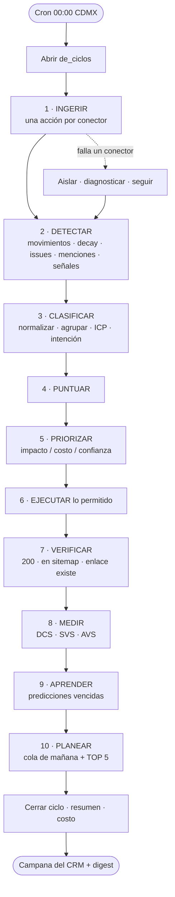
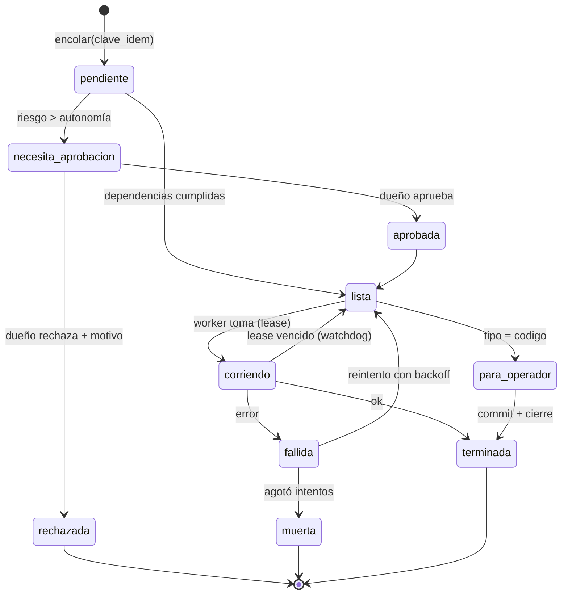
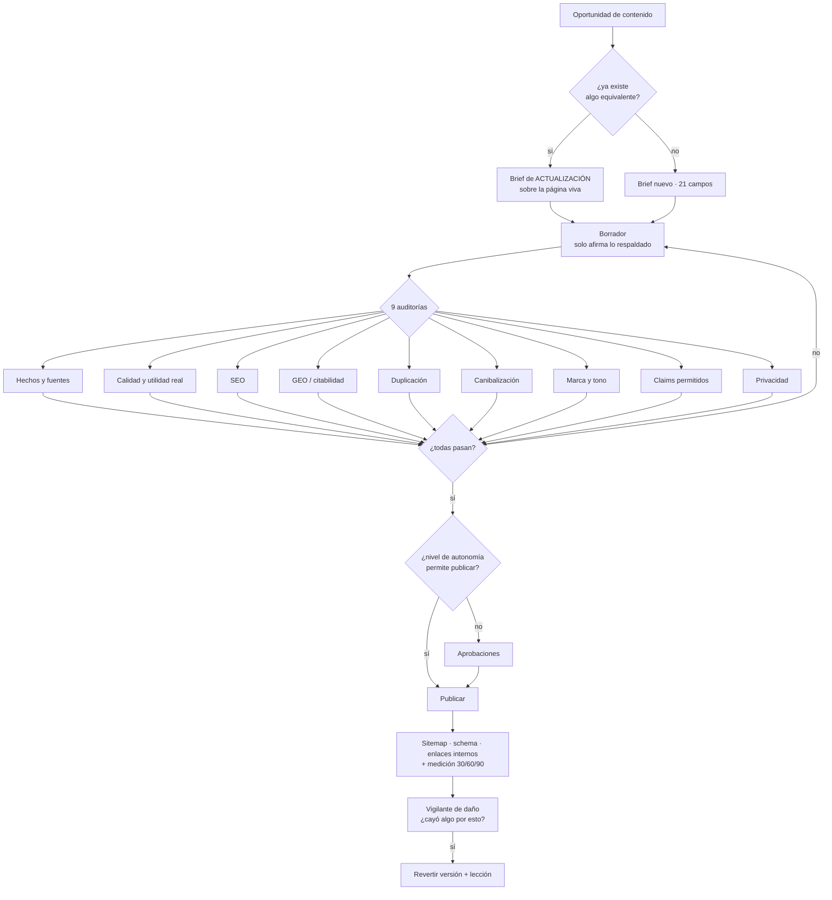
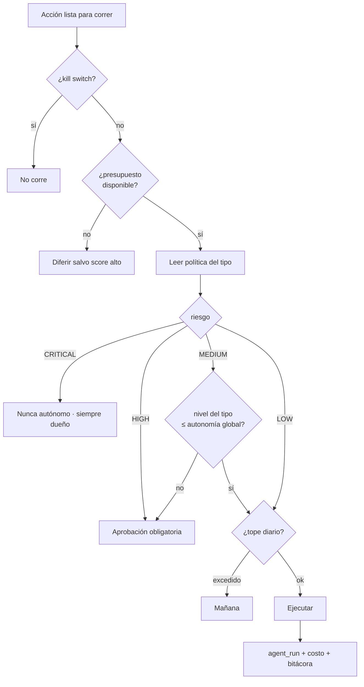
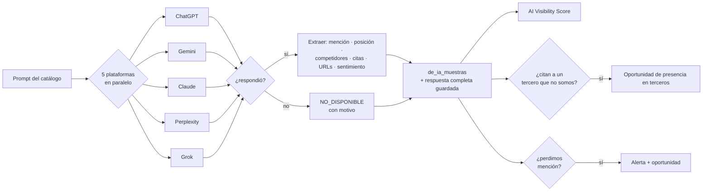
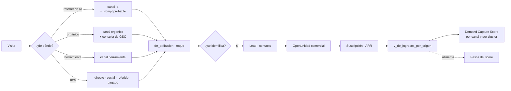
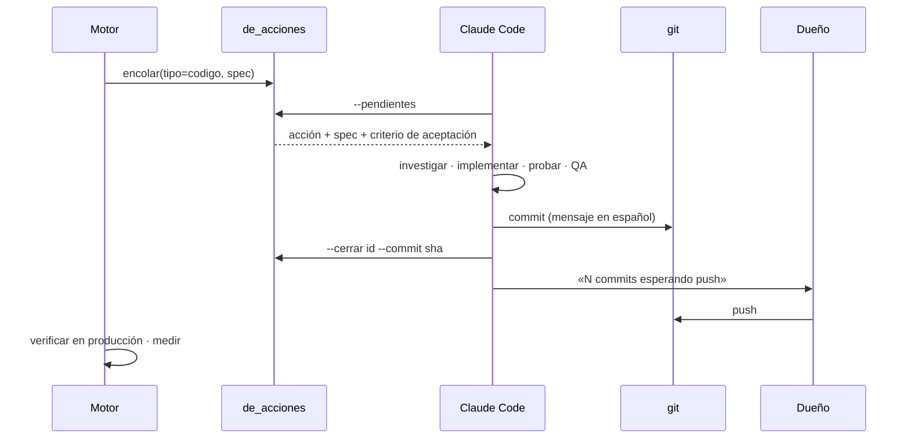
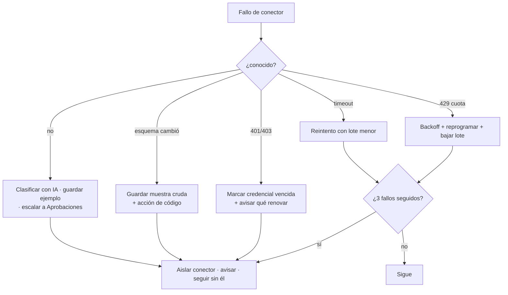
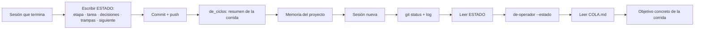

# ANÁLISIS · SACS DEMAND ENGINE
### Casos de uso · Diagramas de flujo · Requerimientos funcionales · Funciones de autonomía · Tablero de tareas

**Fecha:** 15-sep-2026 · **Acompaña a:** `PLAN-DEMAND-ENGINE.md` (arquitectura y fases)
**Estado vivo:** `ESTADO-DEMAND-ENGINE.md` · **Relevo entre sesiones:** §8 de este documento.

---

## 1. Re-análisis del goal — lo que cambia las prioridades

El goal literal del dueño: *«rankear en buscadores y en los buscadores de la IA —ChatGPT, Gemini, Claude— que seamos el referente»*, con un sistema **autónomo** que lo logre y se autoadministre.

Al releerlo contra lo que Sacs realmente es y tiene, cinco hallazgos cambian el orden del plan original:

### H1 · Ser «el referente» en IA no es SEO con otro nombre. Es **citabilidad**.
Una respuesta de IA se arma con tres cosas: lo que el modelo aprendió al entrenarse, lo que recupera en vivo, y lo que **puede citar**. Lo primero no se mueve en meses. Lo segundo y lo tercero sí, y dependen de cosas distintas al ranking:

| Lo que mueve el ranking de Google | Lo que hace que una IA te cite |
|---|---|
| Autoridad de dominio, enlaces, intención | **Dato original** que no existe en otro lado |
| Palabra clave en título y H1 | **Definición canónica** de un término del ramo |
| Frescura | **Respuesta directa, estructurada y verificable** |
| CTR | **Consistencia de la entidad** entre fuentes de terceros |

**Consecuencia:** una página en posición 7 que la IA cita vale más para este goal que una posición 1 que no cita nadie. El motor mide **ambas** y, cuando compiten, prioriza citabilidad. Se agrega un score por página: **Índice de Citabilidad** (RF-GEO-14).

### H2 · Las IAs citan a **terceros** más que a los fabricantes. Ese es el atajo más rápido.
Ante «¿cuál es el mejor software para una cadena de tiendas de ropa?», las cinco plataformas citan sistemáticamente directorios y comparadores (Capterra, G2, Software Advice, GetApp, comparativas de medios) antes que al sitio del fabricante. Sacs **no está o está incompleto** en esos lugares.

**Consecuencia:** nace un motor nuevo que el plan original solo insinuaba dentro de «Autoridad»: **Motor de presencia en terceros** (§6, F-3), con su propia tabla y su propio ciclo. Es la palanca de menor costo y mayor efecto sobre el goal, y **se adelanta a F1-F2**, no espera a F4.

### H3 · El corpus en español del ramo es pobre. Ahí Sacs puede ser dueño de la categoría.
Casi nadie escribe con datos reales sobre operación de moda en México: nivelación entre tiendas, corrida rota en calzado, curva de tallas, sell-through por marca, consignación, mayoreo en Villa Hidalgo. Las IAs responden esas preguntas con material traducido del inglés y genérico.

**Consecuencia:** el motor arranca con un **Corpus Canónico** — las definiciones del ramo, escritas bien una vez, en el lenguaje del ramo (`GLOSARIO-GIROS.md` ya existe como semilla) — antes que con artículos de blog. Es lo que las IAs citan cuando alguien pregunta «qué es X».

### H4 · La demanda real de este ramo en México **no pasa por Google**: pasa por WhatsApp, TikTok y el piso de venta.
Sacs ya tiene 383 contactos, conversaciones reales de WhatsApp, motivos de pérdida, tickets de soporte, 810 cuentas investigadas en el ABM y el agente SDR escuchando todos los días. Ninguna herramienta de SEO del mundo tiene ese dato.

**Consecuencia:** la señal **first-party se vuelve fuente de primera clase, no un complemento** — y se conecta en los dos sentidos con Trabajo Inteligente y con el ABM (RF-DEM-06, RF-DEM-07, RF-ATR-09). Lo que un lead pregunta hoy en WhatsApp es la página que hay que escribir mañana; y la página que se escribió ayer es lo que el agente SDR manda hoy.

### H5 · El final del camino no es una página: es que **la IA ejecute trabajo dentro de Sacs**.
«Pon esta blusa en una modelo», «dime qué comprar», «arma mi catálogo». Cuando un asistente pueda hacerlo llamando a Sacs, Sacs deja de competir por ser mencionado y pasa a ser infraestructura.

**Consecuencia:** el **MCP público** sube de prioridad dentro de F4 y se diseña desde F0 el contrato de las herramientas para que la misma función sirva a: la herramienta gratis web, el MCP y la API. Una implementación, tres canales (RF-HER-08).

### Reordenamiento que sale de H1-H5

| Antes (plan v1) | Ahora | Por qué |
|---|---|---|
| Presencia en terceros dentro de F4 (Autoridad) | **Etapa propia F3-B, arranca junto con GEO** | H2: es el camino más corto a ser citado |
| Corpus canónico no existía | **Primer contenido que se produce, en F2** | H3: es lo que las IAs citan |
| First-party como un conector más | **Fuente de primera clase + bucle con TI y ABM** | H4: es el foso |
| Dataset propio en F4 | **Se empieza a acumular desde F1** (el índice se publica en F4, pero el pipeline de datos arranca antes) | H1: el dato original es lo más citable |
| MCP al final de F4 | **Contrato de herramientas definido en F0**, MCP a mitad de F4 | H5 |

---

## 2. Actores

| Actor | Quién es | Qué hace con el motor |
|---|---|---|
| **A1 · Dueño** | founder | Aprueba lo HIGH, fija autonomía y presupuesto, lee el Resumen, dice «push» |
| **A2 · Consultor** | cs | Consume: qué contenido mandar a un lead, de dónde salió una cuenta |
| **A3 · Orquestador** | sistema | Arma el ciclo, prioriza, cierra con TOP 5 |
| **A4 · Agentes** | 15 especialistas | Investigan, analizan, redactan, auditan, aprenden |
| **A5 · Worker** | cron | Ejecuta la cola |
| **A6 · Operador de código** | Claude Code en el servidor | Toma acciones `tipo=codigo`, implementa, prueba, commitea |
| **A7 · Visitante** | anónimo en el sitio | Genera señal de comportamiento; usa herramientas gratis |
| **A8 · Lead / Cliente** | contacto del CRM | Su pregunta es señal; su conversión es la medida |
| **A9 · IA externa** | ChatGPT, Gemini, Claude, Perplexity, Grok | Sujeto de medición **y** consumidor (MCP, llms.txt, contenido) |
| **A10 · Agente SDR (TI)** | módulo existente | Entrega preguntas reales; consume contenido para mandar |
| **A11 · Motor ABM** | módulo existente | Entrega el universo de cuentas; consume ángulos de contenido |
| **A12 · Proveedor externo** | GSC, GA4, DataForSEO, Reddit, YouTube… | Fuente con cuota, caída y contrato de datos |

---

## 3. Casos de uso

Formato: **ID · Nombre · Actor principal · Disparador → Resultado**. `F` = fase donde se implementa.

### G1 · Ingesta y conectores
| ID | Caso de uso | Actor | Disparador → Resultado | F |
|---|---|---|---|---|
| CU-01 | Conectar una fuente nueva | A1 | Pega credencial en Ajustes → el motor prueba conexión y reporta ok/falta qué | F0 |
| CU-02 | Ingerir Search Console del día | A5 | Cron diario → filas en `de_gsc_diario`, sin duplicar si se repite | F1 |
| CU-03 | Backfill histórico 16 meses | A1 | Botón «traer historia» → lotes con cursor, progreso visible | F1 |
| CU-04 | Ingerir GA4 / analítica propia | A5 | Cron diario → sesiones y conversiones por página y canal | F1 |
| CU-05 | Leer la demanda del propio CRM | A4 | Cron diario → preguntas de leads, motivos de pérdida, tickets → señales | F1 |
| CU-06 | Traer sugerencias de autocompletado | A5 | Cron → variantes reales de búsqueda, marcadas sin volumen | F1 |
| CU-07 | Escuchar comunidades (Reddit, YouTube) | A4 | Cron → hilos y videos del ramo → señales con URL | F1 |
| CU-08 | Comprar volumen y SERP a un proveedor | A5 | Cron semanal → volumen ESTIMADO + quién rankea + AI Overview | F1 |
| CU-09 | Un conector se cae | A3 | 3 fallos seguidos → se aísla, se diagnostica, avisa; los demás siguen | F0 |
| CU-10 | Una fuente devuelve datos absurdos | A3 | Ingesta fuera de rango histórico → no sobrescribe, marca anomalía | F1 |
| CU-11 | Se agota la cuota de una API | A5 | Se detiene ese conector, reprograma, no reintenta en bucle | F0 |
| CU-12 | Apagar una fuente | A1 | Switch en Ajustes → deja de correr sin romper el ciclo | F0 |

### G2 · Demanda: normalizar, agrupar, entender
| ID | Caso de uso | Actor | Disparador → Resultado | F |
|---|---|---|---|---|
| CU-13 | Normalizar una consulta cruda | A4 | Señal nueva → texto normalizado + embedding + intención | F1 |
| CU-14 | Agrupar consultas que significan lo mismo | A4 | 4 formas de preguntar «inventario muerto» → 1 problema canónico | F1 |
| CU-15 | Nombrar el problema canónico | A4 | Cluster nuevo → nombre en lenguaje del ramo + categoría + etapa | F1 |
| CU-16 | Clasificar por ICP | A4 | Señal/cluster → a qué tipo de negocio le duele (tamaño, modelo, mercancía) | F1 |
| CU-17 | Detectar una categoría que falta | A4 | Señales que no caben en la taxonomía → propone categoría nueva | F2 |
| CU-18 | Explorar la demanda | A1 | Abre Explorador → filtra por giro, país, ICP, fuente, naturaleza | F1 |
| CU-19 | Ver de dónde salió una afirmación | A1 | Clic en una señal → fuente, URL, fecha, naturaleza, confianza | F1 |
| CU-20 | Convertir una conversación de WhatsApp en señal | A10 | Lead pregunta algo → señal anonimizada ligada a su cluster | F1 |
| CU-21 | Convertir un motivo de pérdida en señal | A4 | Deal perdido «le faltaba X» → señal de producto y de contenido | F1 |

### G3 · Buscadores
| ID | Caso de uso | Actor | Disparador → Resultado | F |
|---|---|---|---|---|
| CU-22 | Detectar oportunidad de posición 4-20 | A4 | Ciclo diario → oportunidad con impacto estimado | F1 |
| CU-23 | Detectar CTR bajo con muchas impresiones | A4 | Ciclo → acción de reescribir título y meta | F1 |
| CU-24 | Detectar caída de posición o tráfico | A4 | Ciclo → alerta + diagnóstico | F1 |
| CU-25 | Detectar canibalización | A4 | Dos páginas alternando por la misma consulta → propone fusión o diferenciación | F2 |
| CU-26 | Detectar consulta sin página | A4 | Impresiones sin página con esa intención → oportunidad de landing | F1 |
| CU-27 | Auditar salud técnica del sitio | A4 | Crawl semanal → cola de issues priorizada | F2 |
| CU-28 | Verificar indexación real | A4 | URL Inspection → páginas fuera del índice | F2 |
| CU-29 | Detectar contenido que decae | A4 | Caída sostenida → brief de actualización con línea base | F2 |
| CU-30 | Reparar el enlazado interno | A4/A6 | Página nueva o huérfana → enlaces sugeridos y aplicados | F2 |
| CU-31 | Publicar una página programática legítima | A3 | Dimensión con demanda observada y sustancia → página; sin sustancia → rechazo | F2 |

### G4 · Visibilidad en IA (GEO)
| ID | Caso de uso | Actor | Disparador → Resultado | F |
|---|---|---|---|---|
| CU-32 | Medir un prompt en las 5 plataformas | A4 | Ciclo → ¿mencionan a Sacs?, posición, a quién citan, con qué URL | F3 |
| CU-33 | Registrar que una plataforma no se pudo medir | A4 | Error o falta de API → `NO_DISPONIBLE`, nunca un dato inventado | F3 |
| CU-34 | Calcular el AI Visibility Score | A4 | Tras cada barrido → score 0-100 filtrable | F3 |
| CU-35 | Detectar que perdimos una mención | A3 | Sacs salía y ya no → alerta + oportunidad con evidencia | F3 |
| CU-36 | Descubrir prompts nuevos desde consultas reales | A4 | Consulta que trajo un lead → prompt equivalente a medir | F3 |
| CU-37 | Ver qué URL nuestra citan las IAs | A1 | Pantalla IA → páginas citadas, para hacer más de eso | F3 |
| CU-38 | Detectar el competidor que sí citan | A4 | Muestra → quién ocupa el lugar y por qué (qué fuente) | F3 |
| CU-39 | Medir tráfico que llega desde una IA | A4 | Visita con referrer/UTM de IA → canal `ia` en atribución | F3 |
| CU-40 | Calcular el Índice de Citabilidad de una página | A4 | Semanal → qué páginas son citables y cuáles no, y qué les falta | F3 |

### G5 · Terceros y competidores
| ID | Caso de uso | Actor | Disparador → Resultado | F |
|---|---|---|---|---|
| CU-41 | Auditar la presencia de Sacs en directorios | A4 | Semanal → dónde falta, dónde está incompleto, dónde sin reseñas | F3 |
| CU-42 | Proponer alta o mejora en un directorio | A3 | Hueco detectado → acción con aprobación (ficha lista para pegar) | F3 |
| CU-43 | Descubrir un competidor nuevo | A4 | Aparece en SERP o en respuesta de IA → alta automática en la lista | F1 |
| CU-44 | Detectar cambio relevante de un competidor | A4 | Diff de sitemap/precio/función → snapshot; si no cambió, silencio | F1 |
| CU-45 | Encontrar la brecha de contenido | A4 | Competidor responde algo que Sacs no → oportunidad con evidencia | F2 |

### G6 · Oportunidades y decisión
| ID | Caso de uso | Actor | Disparador → Resultado | F |
|---|---|---|---|---|
| CU-46 | Crear una oportunidad sin duplicar | A3 | Señal/movimiento → oportunidad nueva o fusión con la equivalente | F1 |
| CU-47 | Puntuar una oportunidad | A3 | Alta o cambio → score 0-100 con desglose por factor | F1 |
| CU-48 | Registrar la predicción antes de actuar | A3 | Oportunidad aprobada → qué se espera, cuánto y cuándo | F1 |
| CU-49 | Priorizar el día | A3 | Fin del ciclo → TOP 5 por impacto/costo/confianza | F1 |
| CU-50 | Archivar una oportunidad que envejeció | A3 | 60 días sin ejecutarse → baja score o se archiva con motivo | F5 |
| CU-51 | Rechazar una oportunidad y que aprenda | A1 | Descarta con motivo → el motor deja de proponer equivalentes | F5 |
| CU-52 | Elegir entre crear y actualizar | A3 | Hay página parecida → prefiere actualizar antes que publicar otra | F2 |

### G7 · Contenido
| ID | Caso de uso | Actor | Disparador → Resultado | F |
|---|---|---|---|---|
| CU-53 | Generar un brief | A4 | Oportunidad → brief de 21 campos con ángulo, entidades y CTA | F2 |
| CU-54 | Escribir el borrador | A4 | Brief → borrador que solo afirma lo respaldado por la base de conocimiento | F2 |
| CU-55 | Auditar antes de publicar | A4 | Borrador → 9 auditorías; una falla = no se publica | F2 |
| CU-56 | Bloquear un claim inventado | A4 | Afirmación sin respaldo → se reescribe o se corta | F2 |
| CU-57 | Publicar sin necesitar un despliegue | A3 | Aprobado → visible en el sitio en minutos, con sitemap y schema | F2 |
| CU-58 | Revertir una publicación | A1/A3 | Daño detectado o rechazo → vuelve a la versión anterior | F5 |
| CU-59 | Medir una publicación a 30/60/90 días | A3 | Calendario → real contra lo predicho | F5 |
| CU-60 | Escribir el corpus canónico del ramo | A4 | Término del glosario → definición citable con su ficha | F2 |
| CU-61 | Mandar el contenido correcto a un lead | A2/A10 | Lead pregunta X → el agente SDR ofrece la página de X | F5 |

### G8 · Productos de adquisición
| ID | Caso de uso | Actor | Disparador → Resultado | F |
|---|---|---|---|---|
| CU-62 | Evaluar si un problema se resuelve gratis | A4 | Cluster con dolor claro → ficha de herramienta con score de viralidad | F4 |
| CU-63 | Construir el MVP de una herramienta | A6 | Aprobación → herramienta publicada y medida | F4 |
| CU-64 | Convertir uso en lead sin formulario falso | A7 | Usa y ve valor → CTA natural al flujo de Sacs | F4 |
| CU-65 | Exponer la misma función como MCP | A9 | Asistente externo llama la herramienta → ejecuta y cita a Sacs | F4 |
| CU-66 | Publicar un dato original del ramo | A3 | Agregado anonimizado → reporte citable | F4 |
| CU-67 | Verificar privacidad antes de publicar un dato | A3 | Celda con menos de 20 cuentas → no se publica | F4 |

### G9 · Atribución y dinero
| ID | Caso de uso | Actor | Disparador → Resultado | F |
|---|---|---|---|---|
| CU-68 | Ligar una visita a su origen real | A3 | Visita → canal, consulta, prompt, herramienta, contenido | F3 |
| CU-69 | Ligar un lead a su origen | A3 | Alta de contacto → toque de origen y cluster | F5 |
| CU-70 | Ligar un cliente y su ARR al origen | A3 | Suscripción → ingreso atribuido a la cadena completa | F5 |
| CU-71 | Responder «¿qué trae clientes grandes?» | A1 | Pantalla → origen por tamaño de cuenta, no solo por volumen | F5 |
| CU-72 | Reconciliar un cliente sin origen conocido | A3/A2 | Cliente sin toque → pregunta al consultor y cierra el hueco | F5 |
| CU-73 | Calcular el Demand Capture Score | A3 | Diario → % de la demanda detectada que estamos capturando, por canal | F5 |

### G10 · Aprendizaje
| ID | Caso de uso | Actor | Disparador → Resultado | F |
|---|---|---|---|---|
| CU-74 | Comparar predicción contra resultado | A4 | Vence el plazo → acierto/error y su magnitud | F5 |
| CU-75 | Proponer pesos nuevos del score | A4 | Mensual → propuesta con evidencia; se aplica con aprobación | F5 |
| CU-76 | Detectar el patrón de lo que sí funciona | A4 | Varias oportunidades medidas → característica común | F5 |
| CU-77 | Correr un experimento sin declarar ganador antes de tiempo | A3 | Hipótesis → control, muestra mínima, lectura honesta | F5 |
| CU-78 | Detectar que una acción hizo daño | A3 | Caída tras publicar → rollback + lección | F5 |
| CU-79 | Recordar lo que no funcionó | A3 | Antes de proponer → consulta la memoria del motor | F5 |

### G11 · Operación y autonomía
| ID | Caso de uso | Actor | Disparador → Resultado | F |
|---|---|---|---|---|
| CU-80 | Encolar trabajo sin duplicar | A3 | Cualquier detección → acción única por clave | F0 |
| CU-81 | Ejecutar la cola sin pisarse | A5 | Cron cada 5 min → toma con candado, respeta dependencias | F0 |
| CU-82 | Reintentar con criterio y rendirse a tiempo | A5 | Fallo → backoff; agotado → cola muerta + aviso | F0 |
| CU-83 | Liberar una acción atorada | A3 | Lease vencido → vuelve a la cola | F0 |
| CU-84 | Pedir aprobación cuando toca | A3 | Riesgo alto → espera en Aprobaciones con contexto | F0 |
| CU-85 | Aprobar o rechazar desde el celular | A1 | Tap → se ejecuta o se archiva con motivo | F0 |
| CU-86 | Apagar todo de golpe | A1 | Kill switch → nada escribe, todo se puede leer | F0 |
| CU-87 | Subir o bajar la autonomía sola | A3 | Buen historial sube el nivel; rechazos lo bajan | F6 |
| CU-88 | Entregar trabajo de código al operador | A3 | Acción `codigo` → la toma Claude Code, la implementa y commitea | F2 |
| CU-89 | Respetar el presupuesto | A3 | 80% del mes → avisa; 100% → solo lo de score alto | F0 |
| CU-90 | Vigilar la salud del motor | A3 | Ciclo que no corrió, cola atorada, conector caído → aviso | F6 |
| CU-91 | Auto-diagnosticar y auto-reparar | A3 | Error conocido → aplica remedio; desconocido → lo clasifica y escala | F6 |
| CU-92 | Correr en seco para probar un cambio de reglas | A1 | Simulación → qué haría hoy, sin escribir nada | F6 |
| CU-93 | Ajustar sus propias cadencias | A3 | Fuente que no trae nada → baja frecuencia; fuente rica → sube | F6 |
| CU-94 | Declarar lo que le falta | A3 | Pantalla → «no puedo medir X porque falta Y» | F0 |
| CU-95 | Arrancar en frío | A3 | Día 1 sin historia → plan de arranque explícito, no vacío | F1 |
| CU-96 | Proponer un mercado nuevo | A3 | País con señales y sin cobertura → propuesta de activación | F6 |
| CU-97 | Entregar el relevo a la siguiente sesión | A6 | Fin de etapa → estado, decisiones, trampas y siguiente paso escritos | F0 |

### G12 · Gobierno, seguridad, privacidad
| ID | Caso de uso | Actor | Disparador → Resultado | F |
|---|---|---|---|---|
| CU-98 | Impedir que un agente vea datos personales | A3 | Antes de cualquier prompt → anonimización verificada | F1 |
| CU-99 | Impedir una acción prohibida | A3 | Herramienta en lista negra → se rechaza y se registra | F0 |
| CU-100 | Auditar qué hizo un agente y cuánto costó | A1 | Pantalla Agentes → entrada, decisión, cambios, tokens, costo | F0 |
| CU-101 | Respetar permisos del CRM | A2 | Consultor entra → ve lo suyo, no edita ajustes del motor | F0 |
| CU-102 | Aprobar los claims permitidos sobre Sacs | A1 | Pantalla de conocimiento → aprueba en bloque lo que se puede decir | F2 |

---

## 4. Diagramas de flujo

### D1 · Flujo maestro del dato (de la señal al aprendizaje)

```mermaid
flowchart LR
  subgraph FUENTES
    F1[Search Console]:::obs
    F2[Analítica]:::obs
    F3[CRM · WhatsApp · pérdidas]:::obs
    F4[Comunidades]:::obs
    F5[Proveedor SERP/volumen]:::est
    F6[Respuestas de IA]:::obs
    F7[Competidores]:::obs
  end
  FUENTES --> S[de_senales<br/>naturaleza · fuente · confianza]
  S --> Q[de_queries<br/>normalizada + embedding]
  Q --> C[de_clusters<br/>problema canónico + ICP]
  C --> O[de_oportunidades<br/>score 0-100]
  O --> P[de_predicciones<br/>qué espero y cuándo]
  O --> A[de_acciones<br/>LA COLA]
  A --> E{¿autonomía<br/>suficiente?}
  E -- sí --> X[ejecutar]
  E -- no --> AP[Aprobaciones]
  AP --> X
  X --> R[resultado<br/>contenido · arreglo · herramienta · prompt]
  R --> M[de_metricas_diarias<br/>+ de_atribucion]
  M --> L[de_aprendizajes<br/>predicho vs real]
  L -.recalibra.-> O
  L -.memoria.-> C
  classDef obs fill:#EEECFE,stroke:#5B4BD6,color:#1A1630
  classDef est fill:#FBF1DD,stroke:#B7791F,color:#1A1630
```

### D2 · Ciclo diario

### D3 · Estados de una acción en la cola

### D4 · Pipeline de contenido

### D5 · Decisión de autonomía

### D6 · Medición GEO de un prompt

### D7 · Atribución de punta a punta

### D8 · Plano de código (el operador)

### D9 · Auto-reparación de un conector

### D10 · Relevo entre sesiones

---

## 5. Requerimientos funcionales

Prioridad: **M** imprescindible · **S** debería · **C** podría. Cada uno con su criterio de aceptación.

### RF-ING · Ingesta
| ID | Requerimiento | P | F | Criterio de aceptación |
|---|---|---|---|---|
| ING-01 | Cada fuente es un conector independiente con `probar/ingerir/estado` | M | F0 | Ajustes muestra estado real de cada uno |
| ING-02 | Un conector se activa y desactiva sin tocar código | M | F0 | Switch en Ajustes surte efecto en el siguiente ciclo |
| ING-03 | La ingesta es idempotente por ventana | M | F1 | Re-correr un día no cambia el conteo de filas |
| ING-04 | Cada conector tiene cuota diaria y la respeta | M | F0 | Al llegar al tope, se detiene y reprograma |
| ING-05 | El fallo de un conector no afecta a los demás | M | F0 | Prueba con un conector que siempre falla |
| ING-06 | Backfill por lotes con cursor reanudable | M | F1 | Interrumpir a mitad y reanudar no pierde ni duplica |
| ING-07 | Contrato de datos: rechazar ingesta anómala | S | F1 | Volumen fuera de ±70% del histórico → anomalía, no sobrescribe |
| ING-08 | Toda señal guarda naturaleza, fuente, URL, fecha, país, idioma, confianza | M | F1 | Constraint en base: ninguna fila sin naturaleza |
| ING-09 | Las credenciales viven solo en el servidor | M | F0 | Ninguna llave viaja al navegador |
| ING-10 | El motor declara qué fuente le falta y para qué | S | F0 | Pantalla «lo que me falta» con el impacto de cada hueco |

### RF-DEM · Demanda
| ID | Requerimiento | P | F | Criterio |
|---|---|---|---|---|
| DEM-01 | Normalización determinista (minúsculas, sin acentos, sin vacías) | M | F1 | Misma entrada → misma salida |
| DEM-02 | Embedding por consulta y centroide por cluster | M | F1 | Búsqueda semántica devuelve equivalentes |
| DEM-03 | Agrupación por umbral de similitud configurable | M | F1 | ≥90% de aciertos en muestra de 50 |
| DEM-04 | El problema canónico se nombra en lenguaje del ramo | M | F1 | Revisión humana de 20 nombres |
| DEM-05 | Clasificación por taxonomía del journey e ICP | M | F1 | 100% de clusters con categoría, etapa e ICP |
| DEM-06 | Las conversaciones del CRM producen señales anonimizadas | M | F1 | Cero PII, verificado con prueba automática |
| DEM-07 | Los motivos de pérdida producen señales de producto | M | F1 | Cada motivo con texto → señal ligada |
| DEM-08 | Se conservan siempre las consultas originales | M | F1 | El cluster muestra sus variantes literales |
| DEM-09 | El motor propone categorías nuevas, no las crea solo | S | F2 | Propuesta en Aprobaciones |
| DEM-10 | Toda señal se puede rastrear hasta su evidencia | M | F1 | Clic → fuente y URL |

### RF-SEO
| ID | Requerimiento | P | F | Criterio |
|---|---|---|---|---|
| SEO-01 | Detección de posición 4-20 con umbral de impresiones | M | F1 | Oportunidad con impacto estimado |
| SEO-02 | Detección de CTR bajo contra la mediana del rango de posición | M | F1 | No marca CTR bajo en posición 40 |
| SEO-03 | Detección de caída de posición, CTR y tráfico | M | F1 | Alerta con ventana comparativa explícita |
| SEO-04 | Detección de consulta nueva relevante | M | F1 | Entra al cluster correspondiente |
| SEO-05 | Detección de consulta sin página con esa intención | M | F1 | Oportunidad de landing |
| SEO-06 | Detección de canibalización por alternancia de páginas | S | F2 | Propone fusionar o diferenciar |
| SEO-07 | Inventario completo de páginas propias (repo + dinámicas) | M | F1 | 100% del sitemap inventariado |
| SEO-08 | Auditoría técnica con al menos 25 reglas | M | F2 | Issues verificados a mano en muestra de 10 |
| SEO-09 | Verificación de indexación real por URL | S | F2 | Lista de páginas fuera del índice |
| SEO-10 | Core Web Vitals por página | C | F2 | Campo o laboratorio, marcado cuál |
| SEO-11 | Grafo de enlaces internos con huérfanas | M | F2 | Huérfanas = 0 en contenido del motor |
| SEO-12 | Anchors variados, nunca más de 30% exacto | M | F2 | Validación al sugerir |
| SEO-13 | Detección de contenido que decae con línea base | M | F2 | Brief de actualización con el antes |
| SEO-14 | Programático solo con demanda observada y sustancia | M | F2 | Candidatos sin sustancia son rechazados |
| SEO-15 | Sitemap propio del contenido dinámico | M | F2 | Válido y referido en robots.txt |

### RF-GEO
| ID | Requerimiento | P | F | Criterio |
|---|---|---|---|---|
| GEO-01 | Catálogo de prompts por cluster, ICP, país e idioma | M | F3 | 60 prompts semilla activos |
| GEO-02 | Medición en 5 plataformas con interfaz común | M | F3 | Misma estructura de resultado |
| GEO-03 | Se guarda la respuesta completa de cada muestra | M | F3 | Auditable meses después |
| GEO-04 | `NO_DISPONIBLE` explícito con motivo | M | F3 | Nunca un cero que parezca medición |
| GEO-05 | Extracción de mención, posición, competidores, citas, sentimiento | M | F3 | ≥90% correcta en 30 muestras |
| GEO-06 | AI Visibility Score 0-100 con sus 8 indicadores | M | F3 | Filtrable por plataforma, país, ICP, competidor |
| GEO-07 | Serie histórica comparable (mismo prompt, mismo país) | M | F3 | Dos semanas sin huecos |
| GEO-08 | Alerta por mención perdida | M | F3 | Con evidencia de antes y después |
| GEO-09 | Prompts nuevos derivados de consultas que trajeron leads | S | F3 | Al menos 10 prompts de origen real |
| GEO-10 | Canal IA en la atribución | M | F3 | Visita desde chatgpt.com clasificada |
| GEO-11 | `llms.txt` generado desde el inventario vivo | S | F2 | Se actualiza solo al publicar |
| GEO-12 | Schema de entidad (Organization, SoftwareApplication) en todo el sitio | M | F2 | Validado sin errores |
| GEO-13 | Corpus canónico de términos del ramo | M | F2 | 25 definiciones publicadas y citables |
| GEO-14 | Índice de Citabilidad por página | S | F3 | Explica qué le falta a cada página |

### RF-TER · Presencia en terceros *(motor nuevo, ver §1-H2)*
| ID | Requerimiento | P | F | Criterio |
|---|---|---|---|---|
| TER-01 | Catálogo de directorios y comparadores relevantes al ramo y al país | M | F3 | Al menos 20 con su peso medido en citas de IA |
| TER-02 | Auditoría del estado de Sacs en cada uno | M | F3 | Falta / incompleto / completo / con reseñas |
| TER-03 | Priorización por cuántas veces lo citan las IAs | M | F3 | Ordenado por citas observadas, no por fama |
| TER-04 | Ficha lista para pegar (texto, categorías, capturas) por directorio | S | F3 | El dueño solo pega y envía |
| TER-05 | Seguimiento de reseñas y menciones de terceros | S | F4 | Cambios detectados sin ruido |
| TER-06 | Nunca automatizar envíos ni reseñas | M | F3 | Todo alta o respuesta es acción HIGH |

### RF-OPO · Oportunidades
| ID | Requerimiento | P | F | Criterio |
|---|---|---|---|---|
| OPO-01 | Creación idempotente por clave y por similitud semántica | M | F1 | No hay dos oportunidades equivalentes |
| OPO-02 | Score 0-100 con desglose por factor y versión de pesos | M | F1 | Se puede explicar cada punto |
| OPO-03 | 23 tipos de oportunidad soportados | M | F1 | Enum validado |
| OPO-04 | Predicción obligatoria antes de ejecutar las importantes | M | F1 | Sin predicción no pasa a la cola |
| OPO-05 | TOP 5 al cierre de cada ciclo | M | F1 | Ordenado por impacto/costo/confianza |
| OPO-06 | Envejecimiento: bajar score o archivar a los 60 días | S | F5 | Backlog no crece sin límite |
| OPO-07 | El rechazo del dueño enseña | S | F5 | Equivalentes dejan de proponerse |
| OPO-08 | Preferir actualizar antes que crear cuando hay página parecida | M | F2 | Regla probada con caso real |

### RF-CNT · Contenido
| ID | Requerimiento | P | F | Criterio |
|---|---|---|---|---|
| CNT-01 | Brief con los 21 campos | M | F2 | Ninguno vacío al pasar a borrador |
| CNT-02 | Toda afirmación sobre Sacs citada contra la base de conocimiento | M | F2 | Claim sin respaldo bloquea |
| CNT-03 | Nueve auditorías con score y notas | M | F2 | Una falla impide publicar |
| CNT-04 | Publicación sin despliegue | M | F2 | Visible en minutos |
| CNT-05 | Versionado con reversión en un clic | M | F2 | Rollback probado |
| CNT-06 | Schema y metadatos correctos por tipo | M | F2 | Validación automática |
| CNT-07 | Medición programada a 30/60/90 días | M | F2 | Filas creadas al publicar |
| CNT-08 | Prohibido inventar estadísticas, clientes, testimonios o funciones | M | F2 | Auditoría de hechos + lista de claims |
| CNT-09 | Tono y vocabulario del ramo, en español de México | M | F2 | Auditoría de marca |
| CNT-10 | El contenido publicado queda disponible para el agente SDR | S | F5 | El agente lo ofrece al lead correcto |

### RF-HER · Herramientas y distribución
| ID | Requerimiento | P | F | Criterio |
|---|---|---|---|---|
| HER-01 | Evaluación con 9 factores de viralidad | M | F4 | Ranking explicable |
| HER-02 | «Momento Sacs» declarado por herramienta | M | F4 | Dónde el producto multiplica el valor |
| HER-03 | Efectos de 1º, 2º y 3º orden por herramienta | S | F4 | Campo obligatorio en la ficha |
| HER-04 | Uso medido sin guardar datos sensibles | M | F4 | Entradas anonimizadas |
| HER-05 | CTA nacido del flujo, no formulario disfrazado | M | F4 | Revisión de diseño |
| HER-06 | Conversión de la herramienta a lead y a cliente | M | F4 | Cadena completa en atribución |
| HER-07 | MCP público con al menos 3 herramientas | M | F4 | Cliente externo la invoca |
| HER-08 | Una implementación sirve a web, MCP y API | M | F0 | Contrato único definido desde F0 |
| HER-09 | Dataset agregado con k-anonimato ≥ 20 | M | F4 | Verificación antes de publicar |

### RF-ATR · Atribución
| ID | Requerimiento | P | F | Criterio |
|---|---|---|---|---|
| ATR-01 | Toque de origen y último toque por contacto | M | F5 | Sin sobrescribir el que pagó el lead |
| ATR-02 | Canal IA reconocido por referrer y UTM | M | F3 | Lista mantenible |
| ATR-03 | Cadena consulta/prompt/herramienta/página → lead → cliente → ARR | M | F5 | Vista única |
| ATR-04 | Respuesta por tamaño de cuenta, no solo por volumen | M | F5 | «Qué trae cadenas de 10+ sucursales» |
| ATR-05 | Reconciliación de clientes sin origen | S | F5 | Tarea al consultor |
| ATR-06 | Demand Capture Score por canal y cluster | M | F5 | Reproducible y explicable |
| ATR-07 | Costo por oportunidad contra pipeline generado | M | F5 | «gastamos X, produjo Y» |
| ATR-08 | No romper la atribución existente del CRM | M | F5 | Pruebas de regresión |
| ATR-09 | Los leads del ABM heredan el cluster que los movió | C | F5 | Cuenta objetivo ligada a contenido |

### RF-APR · Aprendizaje
| ID | Requerimiento | P | F | Criterio |
|---|---|---|---|---|
| APR-01 | Evaluación automática de predicciones vencidas | M | F5 | 100% evaluadas |
| APR-02 | Propuesta mensual de pesos con evidencia | M | F5 | Nunca se aplica sola |
| APR-03 | Memoria de lo que no funcionó, consultada antes de proponer | M | F5 | No se repite una propuesta rechazada |
| APR-04 | Detección de daño y reversión automática | M | F5 | Caída sostenida tras publicar → rollback |
| APR-05 | Experimentos con control y muestra mínima | M | F5 | No declara ganador antes de tiempo |
| APR-06 | Patrones de lo que produce buenos clientes | S | F5 | Característica común documentada |

### RF-OPE · Operación y autonomía
| ID | Requerimiento | P | F | Criterio |
|---|---|---|---|---|
| OPE-01 | Cola única con clave de idempotencia | M | F0 | Encolar dos veces = una acción |
| OPE-02 | Toma con candado, sin doble ejecución | M | F0 | Dos workers simultáneos no se pisan |
| OPE-03 | Dependencias entre acciones | M | F0 | Orden respetado |
| OPE-04 | Backoff exponencial y cola muerta con aviso | M | F0 | Probado con acción que siempre falla |
| OPE-05 | Watchdog de lease vencido | M | F0 | Acción atorada vuelve a la cola |
| OPE-06 | Matriz de autonomía por tipo, con riesgo | M | F0 | HIGH espera, CRITICAL nunca corre |
| OPE-07 | Kill switch global | M | F0 | Nada escribe; lectura sigue |
| OPE-08 | Presupuesto con aviso al 80% y freno al 100% | M | F0 | Solo score alto al agotarse |
| OPE-09 | Toda corrida deja bitácora con costo | M | F0 | agent_runs + ia_uso |
| OPE-10 | Acciones de código entregadas al operador con criterio de aceptación | M | F2 | Spec suficiente para implementar sin preguntar |
| OPE-11 | Rampa de autonomía con subida y bajada automáticas | S | F6 | Reglas probadas |
| OPE-12 | Salud del motor y latido | M | F6 | Ciclo no corrido = aviso |
| OPE-13 | Auto-diagnóstico de fallos conocidos | S | F6 | Remedios aplicados sin humano |
| OPE-14 | Modo simulación (correr en seco) | S | F6 | Muestra qué haría sin escribir |
| OPE-15 | Auto-ajuste de cadencias por rendimiento de la fuente | C | F6 | Fuente estéril baja frecuencia |
| OPE-16 | Arranque en frío con plan explícito | M | F1 | Día 1 produce trabajo útil |
| OPE-17 | Relevo entre sesiones documentado y automático | M | F0 | Sesión nueva sabe dónde seguir en 2 minutos |
| OPE-18 | Propuesta de mercado nuevo por evidencia | C | F6 | País con señales sin cobertura |

### RF-GOB · Gobierno
| ID | Requerimiento | P | F | Criterio |
|---|---|---|---|---|
| GOB-01 | Anonimización verificada antes de cualquier prompt | M | F1 | Prueba automática con regex |
| GOB-02 | Lista de herramientas prohibidas, inviolable | M | F0 | Registro rechaza la definición |
| GOB-03 | Los guardrails no los cambia ningún agente | M | F0 | Marcados inmutables |
| GOB-04 | Permisos del CRM respetados por sección | M | F0 | Consultor ve, no configura |
| GOB-05 | Aprobaciones con contexto suficiente para decidir | M | F0 | Qué, por qué, qué pasa si sí y si no |
| GOB-06 | Auditoría completa de cada agente | M | F0 | Entrada, decisión, cambios, costo |
| GOB-07 | Datos de clientes nunca en contenido público | M | F4 | Revisión de privacidad documentada |
| GOB-08 | Sin envíos masivos externos automáticos | M | F3 | Política explícita |

### RF-UI
| ID | Requerimiento | P | F | Criterio |
|---|---|---|---|---|
| UI-01 | Resumen responde 9 preguntas en menos de 30 segundos | M | F1 | Medido con cronómetro |
| UI-02 | Marco y sistema de diseño del CRM | M | F0 | Verificado con menú abierto y plegado |
| UI-03 | Paridad móvil real | M | F1 | Aprobar desde el celular |
| UI-04 | Solo lo que cambió y lo que importa | M | F1 | Sin reportes gigantes |
| UI-05 | Cada número dice de dónde salió | M | F1 | Clic → evidencia |
| UI-06 | Manual del motor dentro de Ajustes | M | F6 | El dueño opera sin ayuda |

---

## 6. Funciones nuevas para la autonomía

Las que **no** estaban en el plan v1 y salieron de este análisis. Cada una con el agujero que tapa.

| # | Función | Tapa este agujero | Dónde vive | F |
|---|---|---|---|---|
| **N1** | **Auto-diagnóstico y auto-reparación de conectores** | Hoy un 401 detiene una fuente hasta que alguien mira | `de_conectores.diagnostico`, D9 | F6 |
| **N2** | **Contrato de datos en la ingesta** | Una API que devuelve vacío borraría la historia en silencio | validador por conector | F1 |
| **N3** | **Memoria del motor (`de_memoria`)** | Volvería a proponer lo mismo que ya se rechazó | consulta previa a proponer | F5 |
| **N4** | **Vigilante de daño + reversión** | Publicar puede empeorar y nadie se entera | mide 14 días post-acción | F5 |
| **N5** | **Presupuesto adaptativo por valor** | Se gastaría el mes en lo que llegó primero | asignador en el worker | F0/F5 |
| **N6** | **Envejecimiento de oportunidades** | Backlog infinito, prioridad inútil | reloj en el score | F5 |
| **N7** | **Preferir actualizar sobre crear** | Canibalización propia y contenido duplicado | regla previa al brief | F2 |
| **N8** | **Índice de Citabilidad por página** | Optimizaríamos ranking sin mover el goal real | scoring GEO | F3 |
| **N9** | **Motor de presencia en terceros** | Las IAs citan directorios, no a nosotros | tabla y ciclo propios | F3 |
| **N10** | **Corpus canónico del ramo** | Sin definiciones propias no hay qué citar | primer contenido | F2 |
| **N11** | **Bucle con el agente SDR** | La demanda real se queda en WhatsApp | señales entrantes + contenido saliente | F1/F5 |
| **N12** | **Bucle con el ABM** | 810 cuentas sin ángulo de contenido | cluster ↔ cuenta objetivo | F5 |
| **N13** | **Contrato único de herramientas (web + MCP + API)** | Tres implementaciones de lo mismo | definido en F0 | F0 |
| **N14** | **Watchdog de cola y de ciclos** | Una acción atorada congela el motor | lease + latido | F0/F6 |
| **N15** | **Modo simulación (dry-run)** | Cambiar una regla sería a ciegas | bandera en el ciclo | F6 |
| **N16** | **Auto-ajuste de cadencias** | Fuentes estériles gastando cuota | rendimiento por conector | F6 |
| **N17** | **Pantalla «lo que me falta»** | El motor no puede pedir lo que necesita | autodiagnóstico visible | F0 |
| **N18** | **Canario de datos** | Una consulta conocida que siempre debe traer resultado | prueba de vida diaria | F1 |
| **N19** | **Reconciliación de origen con el humano** | Clientes sin origen rompen el aprendizaje | tarea al consultor | F5 |
| **N20** | **Protocolo de relevo entre sesiones** | Si se acaban los créditos, se pierde el hilo | §8 + `de-operador --estado` | F0 |
| **N21** | **Arranque en frío** | Día 1 sin historia no puede quedarse quieto | plan de arranque | F1 |
| **N22** | **Digest humano diario** | Un tablero que nadie abre no sirve | «lo que aprendí hoy» a WhatsApp | F6 |

**Tablas nuevas que esto agrega al esquema del plan:** `de_memoria`, `de_terceros`, `de_terceros_estado`, `de_anomalias`, `de_salud`. Se crean en la fase donde se usan.

---

## 7. Tablero de etapas y tareas

Cada etapa cierra con: pruebas en verde, QA con navegador si hay pantalla, calificación ≥ 9/10, **commit + push**, y `ESTADO-DEMAND-ENGINE.md` actualizado. IDs `E<etapa>.<tarea>`.

### Etapa 0 · Cimientos *(sin dependencias externas — se puede hacer hoy)*
| ID | Tarea | Cierra con |
|---|---|---|
| E0.1 | Documento de estado + `scripts/de-operador.mjs` (estado, pendientes, tomar, cerrar) | El script imprime estado real |
| E0.2 | Migración F0: config, políticas, conectores, acciones, ciclos, taxonomía, ICP, pesos, memoria, salud | Aplicada e idempotente |
| E0.3 | Librería de cola + RPC de toma con candado | Dos workers no se pisan |
| E0.4 | Worker cron con backoff, cola muerta, watchdog y presupuesto | Prueba de 3 acciones (ok / reintenta / muere) |
| E0.5 | Ciclo (diario/semanal/mensual) que arma la cadena | Cadena recorrida en orden y ciclo cerrado |
| E0.6 | Políticas de autonomía + kill switch + topes | HIGH espera, CRITICAL nunca |
| E0.7 | Modelos actualizados + helper de IA con JSON estricto, lotes y costo | Llamada registrada con costo |
| E0.8 | APIs del CRM para el motor | Con sesión responde, sin sesión 401 |
| E0.9 | Sección «Demand Engine» en el menú + pestaña Sistema (Cola, Agentes, Ajustes, Lo que me falta) | Shots con menú abierto y plegado |
| E0.10 | Contrato único de herramientas (web/MCP/API) | Definición escrita + una función de ejemplo |
| E0.11 | Crons en `vercel.json` + alertas en la campana | JSON válido, auth correcta |
| E0.12 | QA de etapa, calificación, documento, commit + push | ≥ 9/10 |

### Etapa 1 · Inteligencia *(necesita: Search Console, GA4, y opcionalmente Reddit/YouTube/DataForSEO)*
E1.1 Conector Search Console + backfill · E1.2 Conector de analítica · E1.3 Inventario de páginas · E1.4 Normalización, embeddings y clusters · E1.5 Demanda first-party del CRM con anonimización · E1.6 Conectores de comunidad y autocompletado · E1.7 Contrato de datos y canario · E1.8 Reglas de movimientos SEO · E1.9 Score y predicciones · E1.10 Competidores y descubrimiento · E1.11 Pantallas Explorador/SEO/Competidores/Oportunidades · E1.12 Resumen v1 + métricas diarias · E1.13 Arranque en frío · E1.14 QA, calificación, commit + push.

### Etapa 2 · Ejecución
E2.1 Base de conocimiento aprobada · E2.2 Rutas dinámicas + sitemap + schema de entidad + llms.txt · E2.3 Corpus canónico (25 definiciones) · E2.4 Pipeline brief→borrador→9 auditorías · E2.5 Publicar, versionar, medir · E2.6 Regla actualizar-antes-que-crear · E2.7 Decaimiento · E2.8 Rastreador técnico e issues · E2.9 Enlazado interno · E2.10 Operador de código y primera tanda · E2.11 Programático controlado · E2.12 Pantallas Contenido y Aprobaciones · E2.13 QA, calificación, commit + push.

### Etapa 3 · IA y terceros *(necesita: Perplexity, xAI)*
E3.1 Catálogo de prompts · E3.2 Los 5 proveedores · E3.3 Extracción y validación · E3.4 Muestreo y barrido · E3.5 AI Visibility Score · E3.6 Canal IA en atribución · E3.7 Índice de Citabilidad · E3.8 Catálogo y auditoría de terceros · E3.9 Fichas para directorios · E3.10 Pantalla Visibilidad IA · E3.11 QA, calificación, commit + push.

### Etapa 4 · Productos de adquisición
E4.1 Motor de herramientas · E4.2 Infraestructura de herramientas · E4.3-E4.5 Herramientas 1, 2 y 3 · E4.6 MCP público · E4.7 Dataset del ramo con privacidad · E4.8 Autoridad y PR · E4.9 QA, calificación, commit + push.

### Etapa 5 · Aprendizaje y dinero
E5.1 Atribución completa · E5.2 Evaluación de predicciones · E5.3 Memoria del motor · E5.4 Vigilante de daño y reversión · E5.5 Recalibración de pesos · E5.6 Experimentos · E5.7 Demand Capture Score y costo por resultado · E5.8 Envejecimiento y rechazo que enseña · E5.9 Bucles con SDR y ABM · E5.10 QA, calificación, commit + push.

### Etapa 6 · Autonomía continua
E6.1 Rampa · E6.2 Latido y salud · E6.3 Auto-diagnóstico · E6.4 Simulación · E6.5 Auto-ajuste de cadencias · E6.6 Manual del motor · E6.7 Operador automático · E6.8 Mercados nuevos · E6.9 Digest humano · E6.10 Verificación de 7 días · E6.11 Entrega final.

**Ruta crítica:** E0 → E1 → E2 → (E3 ∥ E4) → E5 → E6. E3 y E4 pueden solaparse: E3 depende de llaves de IA, E4 no.

---

## 8. Protocolo de relevo entre sesiones

Pensado para que si se acaban los créditos a media etapa, la siguiente sesión retome sin perder nada.

**Al terminar cada etapa (obligatorio):**
1. `ESTADO-DEMAND-ENGINE.md` actualizado: etapa y tarea donde quedamos, qué se construyó, decisiones tomadas, trampas descubiertas, qué falta, qué se necesita del dueño.
2. `git commit` con mensaje detallado en español + `git push`.
3. Fila en `de_ciclos` con el resumen de la corrida.
4. Memoria del proyecto actualizada si hubo una decisión que no se deduce del código.
5. Mensaje al dueño: qué quedó, links de capturas, qué sigue, qué necesita de él.

**Al empezar una sesión nueva:**
1. `git status && git log --oneline -5`
2. Leer `ESTADO-DEMAND-ENGINE.md` — **primero esto, antes que el plan**.
3. `node scripts/de-operador.mjs --estado` (último ciclo, fallos, cola, presupuesto).
4. Leer `COLA.md` por si el dueño mandó algo.
5. Leer la etapa siguiente en este documento y fijar el objetivo de la corrida.

**Regla:** ninguna etapa se deja a medias sin escribir el estado. Si hay que parar, se para **después** del documento, no antes.
